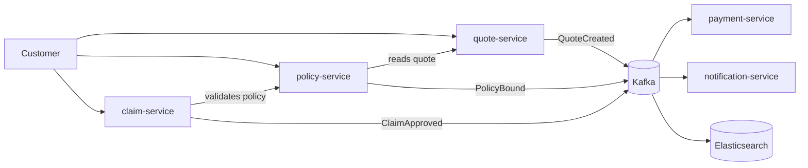
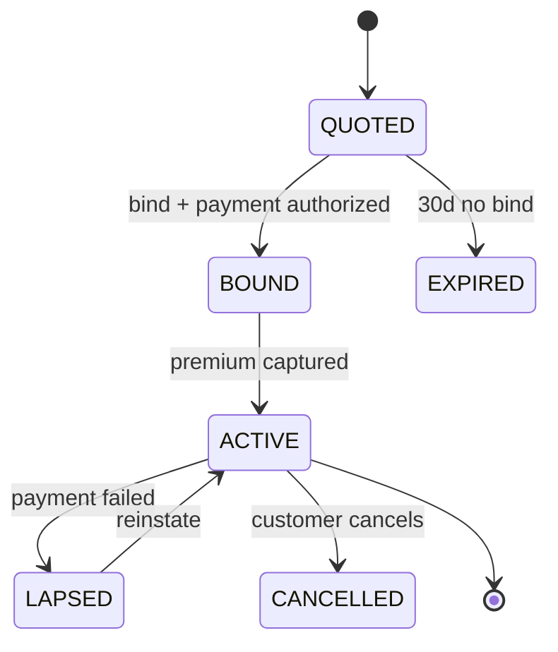

# Aegis — Insurance Platform (Practice Roadmap)

Goal: production-like, fully free, locally runnable microservices platform for SDE-2 infra + backend interview prep.
Build: Java 21 + Maven (multi-module). Stack: Spring Boot 3, MySQL, Kafka, Redis, Elasticsearch, LocalStack (SQS/SNS), Docker, Kubernetes (minikube), Prometheus, Grafana, Loki, Tempo/Jaeger, OpenTelemetry, GitHub Actions, ArgoCD, Terraform.

---

## 1. Domain

| Service | Owns | Core flow |
|---|---|---|
| `quote-service` | quote, rating | collect risk input → price → quote valid 30d |
| `policy-service` | policy, bind, endorsement | bind quote → issue policy → lifecycle |
| `claim-service` | claim, FNOL, adjudication | report loss → validate against policy → settle |
| `payment-service` | premium, payout, ledger | charge premium, pay claim, idempotent |
| `notification-service` | email/SMS fanout | consumes events, no DB of record |

Why this domain: every step has a natural service boundary, real money semantics (idempotency, exactly-once effects), and a state machine worth modelling.

### Happy path

### Policy state machine

---

## 2. Phases

### Phase 0 — Scaffolding (half day)
- Maven multi-module monorepo: parent `pom.xml` with `<dependencyManagement>`, modules `services/*`, `contracts`, `infra`.
- Shared `contracts` module: event POJOs + Avro schemas.
- `docker-compose.yml`: MySQL, Kafka, Redis, Elasticsearch, LocalStack.
- Flyway baseline per service (own schema, no shared tables).
- **Interview talking point:** schema-per-service, why no shared DB.

### Phase 1 — Services, sync only (2–3 days)
- All 5 services, REST, Flyway migrations, Testcontainers integration tests.
- `quote → bind → policy` works end to end over HTTP.
- Resilience4j circuit breaker + retry on every cross-service call.
- **Deliberately hit the pain:** make `bind` call payment synchronously, then feel the latency/coupling. That's your motivation for Phase 2.

### Phase 2 — Async + consistency (3–4 days)
- Kafka as event backbone: `quote.created`, `policy.bound`, `payment.captured`, `claim.approved`.
- **Transactional outbox** in policy-service — the single most interview-valuable pattern here.
- Idempotency: `Idempotency-Key` header → Redis, plus dedupe table on consumers.
- Saga for bind: reserve payment → issue policy → capture; compensate on failure.
- LocalStack SQS/SNS for the notification fanout (so you've touched both Kafka and AWS messaging and can compare them).
- **Interview talking point:** at-least-once delivery + idempotent consumers = effectively-once.

### Phase 3 — Search + CQRS (2 days)
- Debezium CDC: MySQL binlog → Kafka → Elasticsearch projection.
- `GET /search/policies?q=` and claim search served from ES, writes still go to MySQL.
- **Interview talking point:** read model lag, how you bound it, why not dual-write.

### Phase 4 — Observability (2–3 days)
- OTel Java agent on every service → OTel Collector.
- Collector → Tempo (traces), Prometheus (metrics), Loki (logs).
- Trace ID in every log line, clickable Loki → Tempo in Grafana.
- Grafana dashboards: RED metrics per service + one business dashboard (quotes/day, bind conversion, claim cycle time).
- Alert rules: p99 latency, consumer lag, error rate.
- **Interview talking point:** correlating a slow bind across 4 services from one trace.

### Phase 5 — Kubernetes (3–4 days)
- Dockerfiles: multi-stage, distroless, JVM flags tuned for container limits.
- Helm chart per service; minikube cluster.
- Liveness/readiness/startup probes mapped to Spring Actuator.
- HPA on CPU + custom metric (Kafka lag) via prometheus-adapter.
- ConfigMaps/Secrets, resource requests/limits, PDB.
- Terraform to provision LocalStack SQS/SNS queues (IaC practice without paid AWS).
- **Interview talking point:** why readiness ≠ liveness, and what happened when you got it wrong.

### Phase 6 — CI/CD (2 days)
- GitHub Actions: build → test → Testcontainers integration → image build → push to GHCR → bump Helm values.
- ArgoCD on minikube watching the repo → GitOps sync.
- Rolling update, then a deliberate bad deploy + rollback.
- **Interview talking point:** declarative vs imperative deploys.

### Phase 7 — Hardening (2–3 days)
- Keycloak: OAuth2 resource servers, JWT propagation across services.
- k6 load test → find the breaking point → fix it (connection pool, index, cache).
- Chaos: kill a pod mid-saga, partition Kafka, fill a disk. Document what broke.
- Write one incident postmortem per failure. **These are your best interview stories.**

---

## 3. Repo split (end state)

Keep the monorepo until Phase 6 is green, then split:

- `aegis-platform` — architecture docs, mermaid diagrams, the link you give interviewers
- `aegis-quote-service` / `-policy-service` / `-claim-service` / `-payment-service` / `-notification-service`
- `aegis-infra` — Helm, ArgoCD, Terraform, observability stack
- `aegis-contracts` — event schemas, published to GitHub Packages

---

## 3.5 What "production-style, locally" means here

Running on one laptop is the constraint, not the excuse. Every shortcut must be a *config* difference, never a *code* difference:

| Production concern | How it's honoured locally | What would change in real prod |
|---|---|---|
| No shared database | Schema-per-service, separate credentials, no cross-schema joins | Separate RDS instances |
| Config externalised | Spring profiles + ConfigMaps/Secrets, zero hardcoded hosts | Same manifests, different values |
| Migrations | Flyway, forward-only, idempotent, runs on startup | Identical |
| Service discovery | Kubernetes DNS (`policy-service.aegis.svc`) | Identical |
| TLS / auth | Keycloak-issued JWTs validated by every service | Real IdP, same code |
| Observability | OTel auto-instrumentation, trace ID in every log | Same agent, managed backends |
| Deploys | ArgoCD GitOps, rolling updates, probes, rollback | Identical |
| Secrets | K8s Secrets (base64, not encrypted) | Sealed Secrets / AWS Secrets Manager |
| Messaging | Single-broker Kafka (KRaft) + LocalStack SQS/SNS | Multi-broker MSK + real SQS |

Deliberate single-node compromises — name them out loud in interviews rather than pretending otherwise: one Kafka broker (no replication, so no ISR/`min.insync.replicas` story from experience), one MySQL (no replica lag), one ES node (no shard rebalancing), no service mesh.

Hard rule: **nothing may be reachable via `localhost` from inside a service.** If code knows it's running on a laptop, the setup has stopped being production-like.

## 4. Rules for this project

- Java 21 + Maven. Explicit types and lambdas. Records for DTOs/events, sealed interfaces for state, pattern matching in switch. No `var`.
- Every cross-service operation idempotent — retries must be safe.
- Every phase ends with a `docs/` note: what you built, what broke, what you'd do differently.
- No feature is "done" without a test and a dashboard panel.
